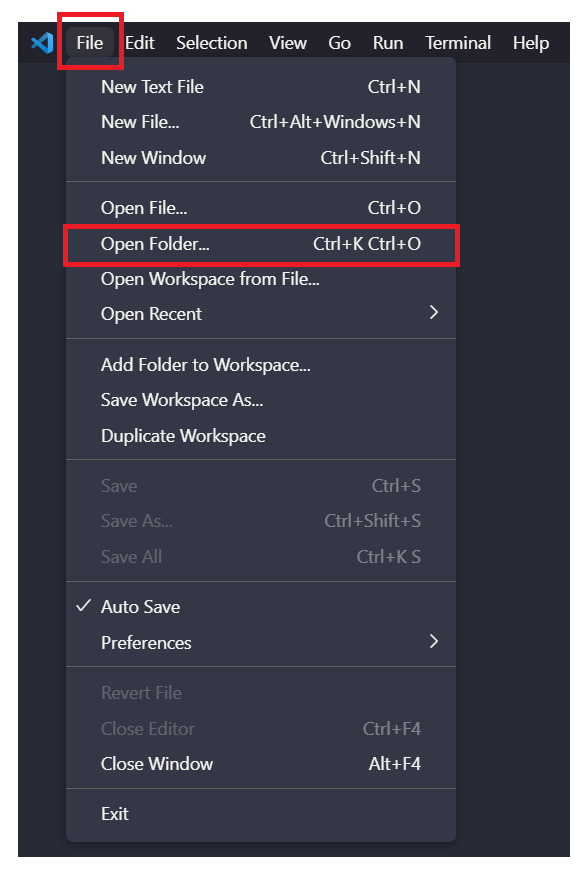
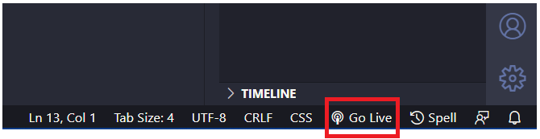

<h1>  Đồ Án Cuối Kỳ - Đồ Họa Máy Tính CS105.N21.KHCL</h1>

## I. Các bước để chạy source code

### Cách 1:
- Bước 1: Cài đặt [Visual Studio Code](https://code.visualstudio.com/download")

- Bước 2: Cài đặt [Live Sever extension](https://ritwickdey.github.io/vscode-live-server/)

- Bước 3: Mở thư mục source code bằng `Visual Studio Code`
   (Chọn File -> Open Folder -> chọn thư mục source code)

- Bước 4: Chờ cho thanh trạng thái (`Status Bar`) nằm ở dưới dùng màn hình load xong, click vào `Go Live` 

### Cách 2:
- Vào trực tiếp [Link GitHub](https://github.com/NhatNguyen2007/Final_Project-CS105.git)

---
## II. Video demo
- [Video](https://drive.google.com/drive/folders/1bxhUIWcBDCz-P3ZLer7Fh1PzjJA8dhz3?usp=sharing)
---
## III. Giảng viên hướng dẫn
- Cáp Phạm Đình Thăng
---
## IV. Danh sách thành viên
- 20521708 - Nguyễn Minh Nhật
- 20521621 - Vũ Văn Minh
